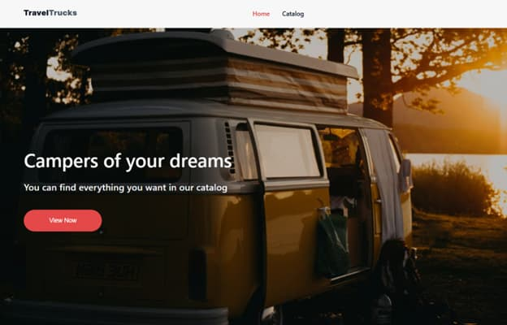
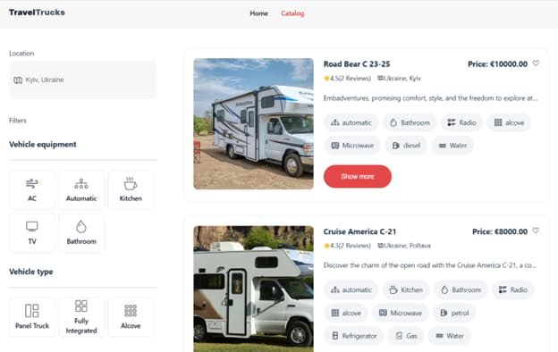
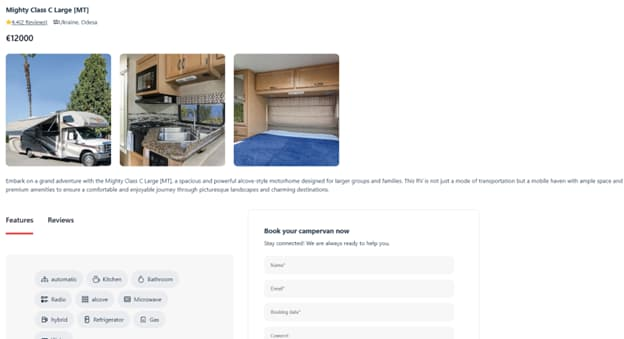

**"TravelTrucks" is a camper rental services.**

Campers of your dreams
You can find everything you want in our catalog

_TravelTrucks is a modern web application built with React and Vite, designed to help users search for and book a variety of campervans._

[Link](https://campers-opal.vercel.app/)

Technologies:

React & Vite: Fast and modern front-end framework and build tool.
Redux: Efficient state management to handle favorites, bookings, and filters.
Formik & Yup: For managing form validation and submission.
Vercel: Deployed on Vercel.

**Pages**

**Home Page:**

should include a banner with the main call to action.

**Catalog:**

a page displaying all available vehicles with options to filter by specific criteria (location, type of vehicle, availability of air conditioning, kitchen, etc.) and the option to add a camper to favorites.

**Individual Camper Page:**

a page with a detailed description of the selected camper, a photo gallery, user reviews, and a booking form. Use the following attributes to describe features, if available on the camper: transmission, engine, AC, bathroom, kitchen, TV, radio, refrigerator, microwave, gas, water. For describing specifications, use the following attributes: form, length, width, height, tank, consumption.

